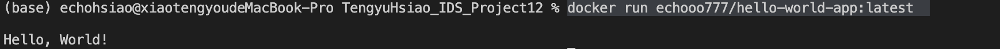

# TengyuHsiao_IDS_Project12
This project creates a simple python application containerized with a dockerfile. The goal here is to both demonstrate running your application within a docker container (using docker run terminal commands) but to also build a docker image in your CI/CD pipeline which will be pushed to Docker Hub or other container management service.

## To build the project with the docker, run:
```bash
docker build -t echooo777/hello-world-app:latest .
```

## To run the project with the docker, run:
```bash
docker run echooo777/hello-world-app:latest
```

Here is the result showing it successfully runs:

